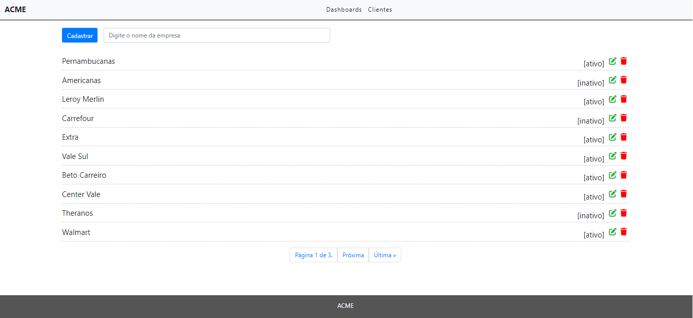
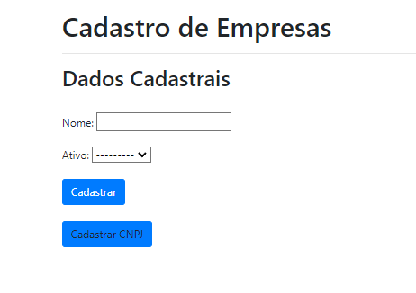
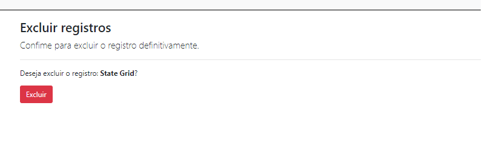

# Projeto Youtan

Projeto de formulário para empresas, criação, edição, armazenamento e leitura dos dados das empresas.

 

## ⚙️ Executando o projeto

Para executar, acesse o arquivo views.py: projeto-youtan/00-initial/projeto/views.py em DIR_LIST = "/projeto-youtan/00_initial/projeto/templates/" coloque o caminho antes de /projeto-youtan/ correspondente a sua máquina.

Para executar basta iniciar python manage.py runserver e abrir o localhost:8000/home/

## 🗃️ Listagem de empresas

Acima na tela mostra uma lista de 10 empresas, aonde é possível editar e excluir, embaixo possui um sistema de paginação que é possível passar para outra lista.

## 📁 Criação de novos registros de empresa

Na área de cadastro é possível registrar uma empresa a partir do seu nome e status ativo/inativo. Na tela também é possível ver um botão Cadastrar CNPJ, na qual é um modal que leva para o formulário de cadastro para o CNPJ, porém ele não executou bem e portanto não aparece também a lista.

## 🗑️ Exclusão de registro de empresas

Ao clicar na lixeira vermelha aonde apresenta a tabela de empresas, é possível excluir um arquivo, aonde sera redirecionado para uma página de confirmação, que se caso clicar em "excluir" a empresa não aparecerá mais na listagem.

## 🔍 Filtro de empresas

Na barra de pesquisas é possível encontrar uma empresa desejada com base no filtro escrito na barra de navegação, basta clicar na tecla "enter" para pesquisar.

## ⚠️ BUGS

Uma das funcionalidades não está funcionando, a criação de CNPJ, apesar do formulario no modal o método POST aparenta não funcionar e não chega no banco de dados, portanto a lista de CNPJ está em falta.

## 🛠️ Construído com

* [Python](https://www.python.org/doc/) - Linguagem base do projeto
* [SQLite](https://www.sqlite.org/index.html) - Banco de dados
* [Django](https://docs.djangoproject.com/pt-br/4.1/) - Framework Web

## ✒️ Autor

* **Gabriel Braga Estefanski** - *desenvolvedor* - [Github](https://github.com/GabrielEstefanski)

## 🎁 Expressões de gratidão

* Desde já gostaria de agradecer a oportunidade para estar se juntando a empresa, independente do resultado foi gratificante terminar o projeto apesar dos problemas que surgiram e das dificuldades, eu busquei aprender mais e refinar algumas técnicas, foi uma experiência desafiadora e incrível.

---
⌨️ com ❤️ por [Gabriel Braga Estefanski](https://www.linkedin.com/in/gabriel-estefanski/) 😊